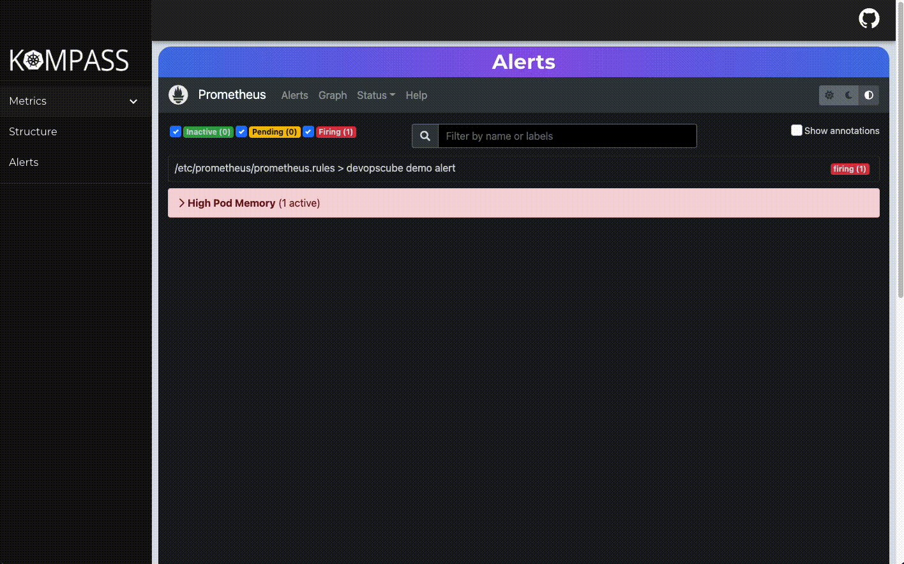

### Need direction on your Kubernetes cluster? Kompass can help!

# What is Kompass?

Kompass is an easy to integrate, open-source monitoring tool for your Kubernetes cluster. It's a one-stop shop to visualize and monitor your cluster's structure and health. Kompass combines an interactive dashboard of your cluster's structure, a suite of essential tools to monitor time-series data and alerts, and Grafana based dashboards to help users analyze those metrics in real time.

# Features

### Structure

Our interactive structure page displays your cluster's architecture along with relevant data like names, IP adresses, and resource allocations.


### Metrics

Our persisted Grafana dashboards take the guess work out of tracking your cluster's health. Quickly view your cluster's resource utilization, network data, or pod health per namespace.


### Alerts

Kompass also includes full Prometheus Alerts integration to access alerts, graphs, and direct prom-queries.



# Setup

### Notes:

- This app assumes you have direct access to your Kubernetes cluster and have Kubernetes CLI (Kubectl) installed.

## Clone repo & cd into it, then run:

```

minikube start --driver=docker

kubectl create namespace monitoring

kubectl apply -f Manifest/

```

---

### Display your grafana & prometheus pod names:

```

kubectl get pod --namespace=monitoring

```

---

### Forward ports to view application:

Open a new tab in your terminal with command+'t' and forward your grafana port:

```

kubectl port-forward <grafana-pod-name> --namespace=<namespace-grafana-is-in> 3000:3000

```

Open a new tab in your terminal with command+'t' and forward your prometheus port:

```

kubectl port-forward <prometheus-pod-name> --namespace=<namespace-prometheus-is-in> 9090:9090

```

Open a new tab in your terminal with command+'t' and forward your kompass port:

```

kubectl port-forward <kompass-pod-name> --namespace=<namespace-kompass-is-in> 3036:3036

```

---

# Built With

- [Typescript](https://www.typescriptlang.org/)

- [React](https://reactjs.org/docs/getting-started.html)

- [React Router](https://reactrouter.com/)

- [Redux](https://redux.js.org/usage/usage-with-typescript)

- [Material UI](https://mui.com/material-ui/guides/typescript/)

- [Node.js](https://nodejs.org/en/docs/)/[Express](https://expressjs.com/)

- [Docker](https://docs.docker.com/)

- [Kubernetes](https://kubernetes.io/docs/home/)

- [Kubernetes-client/node](https://www.npmjs.com/package/@kubernetes/client-node)

- [Prometheus](https://prometheus.io/docs/introduction/overview/)

- [Grafana](https://grafana.com/docs/grafana/latest/)

# Connect With the Core Team:

- Aileen Chan - [Github](https://github.com/aileenchany) | [LinkedIn](https://www.linkedin.com/in/aileen-chanmiranda/)

- Corey Morrison - [Github](github.com/coremore35) | [LinkedIn](linkedin.com/in/corey-morrison/)

- Kristin Tillotson - [Github](https://github.com/TillotsonK) | [LinkedIn](https://www.linkedin.com/in/kristintillotson/)

- Connor McGuire - [Github](https://github.com/TheConMcG) | [LinkedIn](https://www.linkedin.com/in/connormmcguire/)
